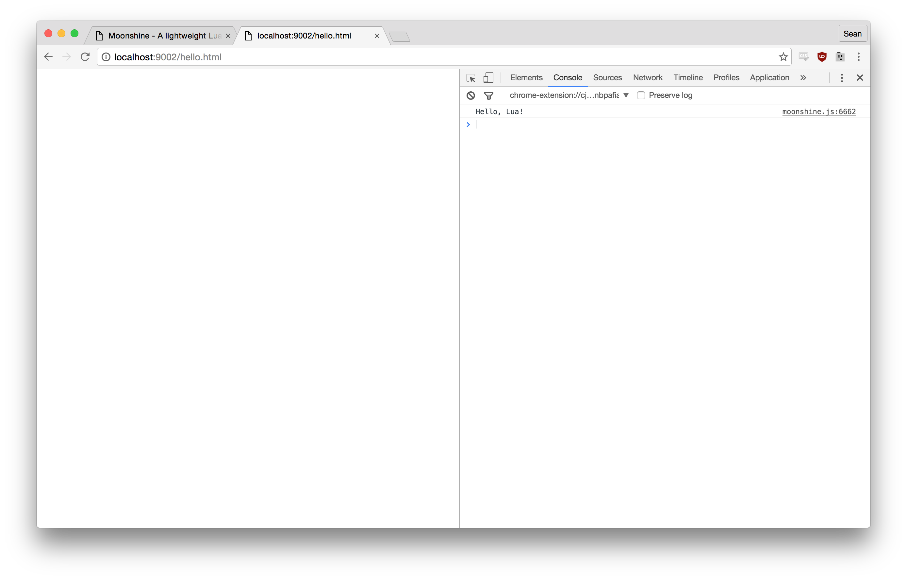

# Getting Started Guide

## Prerequisites

```
brew lua51
brew install npm
```

----

## Create sample file

in `hello.lua`

```
print "Hello, Lua!"
```

## Prepare source

Moonshine loads a json representation of lua bytecode.

```
node bin/moonshine distil hello.lua
```

`jq . hello.lua.json`

```
{
  "sourceName": "@hello.lua",
  "lineDefined": 0,
  "lastLineDefined": 0,
  "upvalueCount": 0,
  "paramCount": 0,
  "is_vararg": 2,
  "maxStackSize": 2,
  "instructions": [
    5,
    0,
    0,
    0,
    1,
    1,
    1,
    0,
    28,
    0,
    2,
    1,
    30,
    0,
    1,
    0
  ],
  "constants": [
    "print",
    "Hello, Lua!"
  ],
  "functions": [],
  "linePositions": [
    1,
    1,
    1,
    1
  ],
  "locals": [],
  "upvalues": [],
  "sourcePath": "hello.lua"
}
```

## HTML

```
<html>
    <head>
        <script src="./vm/moonshine.js"></script>
        <script>
            var vm = new shine.VM();
            vm.load('./hello.lua.json');
        </script>
    </head>
    <body>
    </body>
</html>
```

## Serve Demo Application

```
npm install -g http-server
http-server
```

Load Chrome or Firefox, open devtools and open console. Should see

```
Hello, Lua!
``` 


